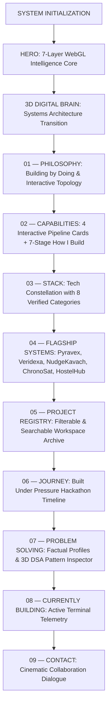

<div align="center">

# 🌐 KARTIK VERMA — IMMERSIVE 3D PORTFOLIO
### **AI • DATA SCIENCE • FULL-STACK DEVELOPER**
*B.Tech Computer Science & Engineering — Data Science | PSIT Kanpur*

[](https://react.dev/)
[](https://threejs.org/)
[](https://www.typescriptlang.org/)
[](https://vitejs.dev/)
[](https://tailwindcss.com/)
[](https://www.framer.com/motion/)

<br />

> *"I don't just write code — I build systems."*  
> A high-end, scrollytelling creative developer portfolio presenting engineering discipline, verified technical facts, and real-time interactive 3D WebGL visualizations.

[**Explore Live Experience**](https://github.com/kartikvermagit-ds/kartikportfolio) • [**Flagship Systems**](#-flagship-systems) • [**Engineering Architecture**](#-system-architecture--experience-flow) • [**Connect**](#-verified-profiles--contact)

---

</div>

<br />

## 🔭 Executive Overview

This repository houses the source code for **Kartik Verma's** flagship developer portfolio. Engineered with an Awwwards-inspired aesthetic, the application operates as an interactive digital engineering system rather than a static resume or card list.

It features:
- **7-Layer WebGL Intelligence Core**: Custom Three.js / React Three Fiber scene with instanced starfields, orbital trajectories, telemetry packets, and reactive geometric morphing.
- **Unified Sequential Narrative**: Seamless transition from Identity through 9 standardized engineering phases.
- **Evidence-First Technical Fact Sheets**: Strict elimination of fabricated statistics in favor of verified technical facts, data sources, and architecture schemas.
- **Zero React 19 Sub-Root Warnings**: Clean separation of 3D canvas viewport rendering and crisp HTML HUD telemetry overlays.
- **Interactive Algorithmic & System Diagrams**: Live interactive topology for engineering disciplines and an interactive 3D DSA pattern inspector.

---

## 🏛️ System Architecture & Experience Flow

The user journey is structured as a continuous engineering initialization flow:



---

## 🚀 Flagship Systems

Every featured flagship project implements a standardized information hierarchy: **Positioning • The Problem • What Was Built • Key Systems • Verified Technical Facts • Source Links**.

| # | System | Domain | Interactive 3D Metaphor | Verified Tech Stack | Links |
|---|---|---|---|---|---|
| **01** | **PYRAVEX** | Satellite Thermal Intelligence | Interactive command globe with Indian subcontinent target sector, FIRMS thermal anomaly hotspots, orbital satellite, and live telemetry beam. | React, TypeScript, FastAPI, Python, Leaflet, NASA FIRMS API, Open-Meteo | [Repository](https://github.com/kartikvermagit-ds/PYRAVEX-2) • [Live App](https://pyravex-2.vercel.app/) • [API](https://pyravex-backend.onrender.com/) |
| **02** | **VERIDEXA** | Industrial Spec Verification | 3D multi-stage document intelligence pipeline demonstrating PDF ingestion, deterministic range/unit conflict checks, and coordinate evidence links. | React, TypeScript, FastAPI, Python, SQLAlchemy, LLM Workflows | [Repository](https://github.com/kartikvermagit-ds/Veridexa) |
| **03** | **NUDGEKAVACH** | Interface Manipulation Auditing | 3D browser session auditor capturing observable UI manipulation signals (artificial timers, pre-selections) into localized SHA-256 evidence logs. | JavaScript, Browser Extension API, Electron, Node.js | [Repository](https://github.com/kartikvermagit-ds/NudgeKavach) |
| **04** | **CHRONOSAT** | Satellite Temporal Interpolation | 3D split-phase timeline demonstrating optical flow motion vector calculation and deep learning intermediate frame synthesis between T0 and T1 passes for BAH 2026. | Python, FastAPI, React, Vite, Optical Flow, Deep Learning | [Repository](https://github.com/kartikvermagit-ds/ChronoSat-BAH2026) |
| **05** | **HOSTELHUB** | Campus Academic Sharing | Miniature 3D digital campus resource network mapping Class Test (CT) archives, notes cloud, discussions, and vault clusters. | React, Tailwind CSS, Node.js, Express, Supabase, PostgreSQL | [Repository](https://github.com/kartikvermagit-ds/HostelHub) |

---

## 🧠 Engineering Methodology: From Idea → System

A 7-stage protocol engineered to validate technical feasibility before scaling:

```text
01. PROBLEM     → Identify real technical constraints from raw requirements.
02. RESEARCH    → Analyze existing literature, documentation, and data schemas.
03. PROTOTYPE   → Build minimal end-to-end telemetry pipelines to prove feasibility.
04. VALIDATE    → Stress-test edge cases, noisy data feeds, and conflict conditions.
05. BUILD       → Implement modular, type-safe APIs and responsive user interfaces.
06. DEPLOY      → Release on containerized and edge networks (Render, Vercel, Supabase).
07. ITERATE     → Profile memory footprints, optimize query performance, and refine UX.
```

---

## 🌌 Technology Constellation

Grounded entirely in repository commits and implementation evidence — **strictly zero percentage bars**:

### 💻 Languages
- **Python**: Core language for AI pipelines, FastAPI backends, and geospatial anomaly clustering.
- **C++**: Algorithmic problem solving, data structures implementation, and complexity drills.
- **TypeScript**: Strongly typed architectures for frontend dashboards and web tools.
- **Java**: Object-oriented design, data structures, and foundational computer science.
- **SQL**: Relational schema design, normalization, indexing, and row-level security.

### 🎨 Frontend & Motion
- **React 19**: Modern component architecture, reactive state hooks, and high-performance layout rendering.
- **Vite 8**: ESM build engine with instantaneous hot-module-replacement (HMR).
- **Tailwind CSS v4**: Utility-first styling with custom dark tokens (`#05070B`, `#080D16`, `#111827`).
- **Framer Motion**: Physics-based springs, layout animations, and scroll-linked progress indicators.

### ⚙️ Backend & Infrastructure
- **FastAPI**: Asynchronous Python REST microservices with automated Pydantic schema validation.
- **Node.js & Express**: Event-driven server runtimes and Electron background processes.
- **Docker**: Containerized runtime packaging for cloud microservices.
- **Vercel & Render**: Frontend edge deployment and containerized asynchronous web services.

### 📊 Data & Cloud
- **PostgreSQL**: Relational data modeling with foreign key constraints, indexes, and transactions.
- **Supabase**: Managed PostgreSQL with Row-Level Security (RLS) and authenticated storage buckets.
- **Pandas**: DataFrame analysis, time-series data aggregation, and anomaly filtering.

### 🤖 AI & Geospatial
- **LLM Workflows**: Grounded prompt engineering and deterministic schema extraction.
- **Ollama**: Self-hosted open-weights models for privacy-first local experimentation.
- **Document Intelligence**: Multi-stage PDF parsing, coordinate mapping, and unit normalization.
- **NASA FIRMS**: MODIS & VIIRS active satellite fire anomaly data feeds.
- **Open-Meteo**: Atmospheric weather vector and humidity telemetry integration.
- **Leaflet & OpenStreetMap**: Interactive geospatial mapping with anomaly marker clustering.

---

## ⚔️ Competitive Builds & Hackathons

- **Bharatiya Antariksh Hackathon 2026**: *ChronoSat* — Satellite image frame interpolation enhancing temporal revisit resolution using optical flow and deep learning.
- **Smart India Hackathon 2026**: *PYRAVEX* — Satellite thermal intelligence and automated geospatial threat monitoring platform.
- **UniHack 2026**: *Veridexa* — Industrial datasheet grounding and conflict detection pipeline.
- **HackerRank Orchestrate**: 24-hour build challenge solving timed architectural and algorithmic problems.
- **Vibe2Ship**: Rapid zero-to-one product development sprint.

---

## 🧩 Algorithmic Discipline & DSA Topology

Continuous practice across foundational computer science structures:
- **Graphs**: BFS, DFS, Dijkstra’s Algorithm, Topological Sort, Connected Components.
- **Trees**: Binary Search Trees (BST), Lowest Common Ancestor (LCA), Level-Order Traversal.
- **Dynamic Programming**: Memoization, Tabulation, State Compression, Optimal Substructure.
- **Arrays & Strings**: Two Pointers, Sliding Window, Prefix Sum Arrays.
- **Stacks & Queues**: Monotonic Stacks, Parentheses Evaluation, Deques.
- **Hashing**: Amortized O(1) lookups, collision resolution, frequency hashing.
- **Linked Lists**: Fast & Slow Pointers (Floyd’s Cycle Detection), Reversals.

---

## 📂 Repository File Structure

```text
Portfolio/
├── public/
│   ├── favicon.svg             # Custom geometric KV monogram
│   └── icons.svg
├── src/
│   ├── components/
│   │   ├── 3d/                 # Dedicated 60 FPS WebGL Scenes
│   │   │   ├── AlgoGraphScene.tsx            # Interactive 3D DSA pattern inspector
│   │   │   ├── BrainNetworkScene.tsx         # Digital brain systems topology
│   │   │   ├── ChronoSatInterpolationScene.tsx # Satellite frame interpolation
│   │   │   ├── Hero3DScene.tsx               # 7-layer WebGL intelligence core
│   │   │   ├── HostelHubCampusScene.tsx      # Campus resource cluster network
│   │   │   ├── NudgeKavachAuditorScene.tsx   # Client-side DOM auditor session
│   │   │   ├── PyravexGlobeScene.tsx         # Command globe with FIRMS anomalies
│   │   │   └── VeridexaPipelineScene.tsx     # Document extraction pipeline
│   │   ├── common/             # Reusable UI & Layout Primitives
│   │   │   ├── Card3D.tsx                    # Perspective 3D tilt card
│   │   │   ├── CustomCursor.tsx              # Adaptive spring cursor with states
│   │   │   ├── Icons.tsx                     # Lightweight platform SVGs
│   │   │   ├── LoadingScreen.tsx             # Snappy initialization screen
│   │   │   ├── MagneticButton.tsx            # Fluid spring magnetic button
│   │   │   ├── Navbar.tsx                    # Fixed collision-safe scrollspy navbar
│   │   │   └── SectionHeading.tsx            # Standardized typography & badges
│   │   └── sections/           # 9 Standardized Journey Sections
│   │       ├── AboutSection.tsx              # 01 — PHILOSOPHY + Topology
│   │       ├── WhatIBuildSection.tsx         # 02 — CAPABILITIES + How I Build
│   │       ├── TechUniverseSection.tsx       # 03 — STACK + Constellation
│   │       ├── FlagshipProjectsSection.tsx   # 04 — FLAGSHIP SYSTEMS
│   │       ├── ProjectExplorerSection.tsx    # 05 — PROJECT REGISTRY
│   │       ├── HackathonJourneySection.tsx   # 06 — JOURNEY Timeline
│   │       ├── CodingJourneySection.tsx      # 07 — PROBLEM SOLVING
│   │       ├── CurrentlyBuildingSection.tsx  # 08 — CURRENTLY BUILDING
│   │       ├── ContactSection.tsx            # 09 — CONTACT Finale
│   │       ├── Footer.tsx                    # Minimal credits & social links
│   │       ├── HeroSection.tsx               # Hero entrance
│   │       ├── BrainTransitionSection.tsx    # Systems narrative transition
│   │       └── GitHubLiveSection.tsx         # GitHub API ecosystem analytics
│   ├── data/                   # Structured, Audit-Proof Data
│   │   ├── githubCache.json    # Curated fallback repository data
│   │   ├── process.ts          # 7-Stage How I Build workflow
│   │   ├── profiles.ts         # Verified profile links & telemetry
│   │   ├── projects.ts         # Flagship systems dossiers
│   │   ├── technologies.ts     # Tech constellation nodes
│   │   └── timeline.ts         # Hackathon milestones
│   ├── hooks/                  # Custom Performance Hooks
│   │   ├── useGitHubData.ts    # Live API sync with cached fallback
│   │   ├── useMousePosition.ts # Throttled normalized cursor coordinates
│   │   ├── useReducedMotion.ts # prefers-reduced-motion accessibility
│   │   └── useScrollProgress.ts # RAF-driven scroll progress
│   ├── types/                  # Strict TypeScript Type Definitions
│   │   └── index.ts
│   ├── App.tsx                 # Main Root Application
│   ├── index.css               # Tailwind CSS v4 & custom variables
│   └── main.tsx
├── package.json
├── tsconfig.json
├── vite.config.ts
└── README.md
```

---

## ⚡ Quick Start & Local Development

### Prerequisites
- **Node.js**: v18.0.0 or higher
- **npm**: v9.0.0 or higher

### Installation

1. **Clone the repository:**
   ```bash
   git clone https://github.com/kartikvermagit-ds/kartikportfolio.git
   cd kartikportfolio
   ```

2. **Install dependencies:**
   ```bash
   npm install
   ```

3. **Start the local development server:**
   ```bash
   npm run dev
   ```
   The site will be live at `http://127.0.0.1:5173/`.

4. **Build for production:**
   ```bash
   npm run build
   ```
   Generates optimized assets inside the `dist/` directory.

5. **Preview production build locally:**
   ```bash
   npm run preview
   ```

---

## 🎯 Performance & Accessibility Highlights

- **Target 60 FPS**: Low-poly WebGL primitives, instanced buffer geometries, and requestAnimationFrame throttling for all pointer/scroll listeners.
- **Zero Reconciliation Latency**: Eliminated Drei `<Html>` internal sub-root overhead in favor of hardware-accelerated CSS and Canvas overlays.
- **Accessibility & Reduced Motion**: Full support for `prefers-reduced-motion: reduce`, keyboard navigable elements, and semantic HTML5 landmarks.
- **No Heavy External 3D Assets**: All geometries are programmatically generated inside Three.js, maintaining an ultra-light bundle size (~380 kB gzipped).

---

## 📬 Verified Profiles & Contact

<div align="center">

| Platform | Handle / Link | Purpose |
|:---:|:---:|:---|
| **GitHub** | [@kartikvermagit-ds](https://github.com/kartikvermagit-ds) | Public source code, projects & utilities |
| **LinkedIn** | [/in/kartik-verma-ds](https://www.linkedin.com/in/kartik-verma-ds/) | Professional network & career updates |
| **LeetCode** | [@kartik-verma_29](https://leetcode.com/u/kartik-verma_29/) | Algorithmic practice & DSA implementations |
| **Codeforces** | [@kv5612872](https://codeforces.com/profile/kv5612872) | Competitive programming contest practice |
| **HackerRank** | [@kv5612872](https://www.hackerrank.com/profile/kv5612872) | Skill verification & build challenges |
| **Email** | [kv5612872@gmail.com](mailto:kv5612872@gmail.com) | Direct inquiries & collaboration proposals |

<br />

**Built with React 19, Three.js & curiosity.**  
*© 2026 Kartik Verma. All rights reserved.*

</div>
